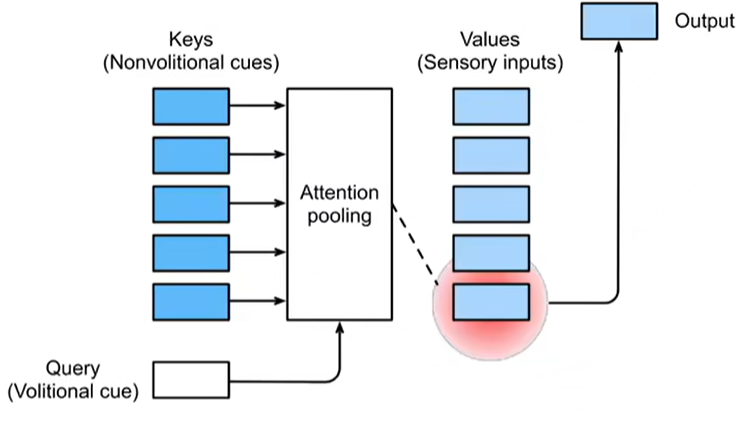

# 注意力机制

注意力机制是一种模仿人类注意力过程的学习算法，它使得模型能够选择性地关注输入中的重要信息，从而提高任务处理的性能。目前，注意力机制在机器学习以及自然语言处理领域都被广泛应用，很多主流的深度网络架构设计上都会包含注意力网络层。

!!! note "随意与不随意线索"
    动物需要在复杂环境下关注有效的信息，而人类会根据随意和不随意线索选择注意点。

    这里 “**随意**” 的概念实际上有点抽象，举一个更容易理解的例子，针对这些图标 :material-et: &nbsp; :material-axe: &nbsp; :lock: &nbsp; :material-cow: &nbsp; :material-book: ，如果你没有特别目标的话，你的注意力通常会关注到颜色的突出的 :lock: 图标上，这种就叫做 **不随意线索**；但是如果你此刻想读书，那么你的注意力会落在 :material-book: 图标上，这种叫做 **随意线索**。

## 1. 注意力机制简介

卷积、全连接、池化层都只考虑不随意线索，注意力机制则会显示地考虑随意线索。随意线索被称为查询（Query），每个输入是一个不随意线索（Key）和值（Value）的键值对，通过注意力池化层来有偏向性地选择某些输入。

