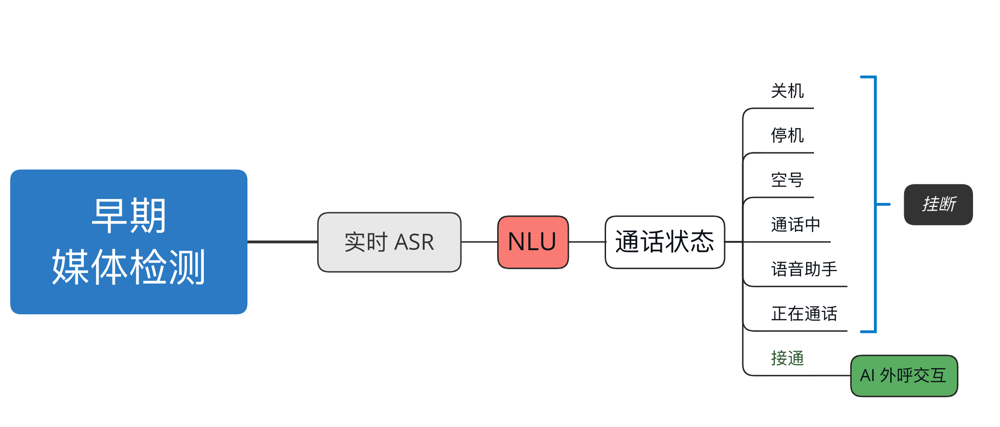

# 早期媒体检测

## 1. 背景

在语音呼叫场景中，经常会遇到拨通电话后听到是“空号”、“停机”、“关机”、“通话中” 等语音播报，这在人工呼叫的场景中还可以及时手动挂断，并不会造成太大的损失。但在 AI 外呼机器人场景中，机器人如果无法正确且高效得提前识别到通话状态，那就必须无效等待 60 秒（运营商端限制）。这显然是一个非常值得优化的问题，如果我们能将 60 秒的播报优化到 10 秒，成本和效率都能有 80%+ 的优化。

早期媒体检测便是解决此类问题一种技术手段，通过音频检测、NLU 意图识别等，提前识别到号码的无效状态，及时切断呼叫流程，节省相应的资源出来。

<!-- more -->

## 2. 技术架构



!!! warning "无声状态"

    通话过程中，存在电话接通后但无实际语音内容输出，所以我们送入 ASR 引擎的数据流应该为接通状态前的数据。

## 3. 文本转写

首先我们对收集到的录音进行文本转写，后续搭建一个文本相似度或者意图识别的 NLP 模型，实时转写的过程中识别当前呼叫是否是无效的状态。

```python linenums="1"
import os
import librosa
import pandas as pd
from funasr import AutoModel

audios = [
    f"{fdir}/{fpath}" 
    for fdir, _, fpaths in list(os.walk("data"))[1:]
    for fpath in fpaths 
    if fpath.endswith(".mp3") or fpath.endswith(".wav")
]

model = AutoModel(
    model="paraformer-zh", 
    vad_model="fsmn-vad",
    vad_kwargs={"max_single_segment_time": 60000},
    punc_model="ct-punc", 
    # spk_model="cam++"
    )

results = []
for audio in audios:
    audio_data, sr =  librosa.load(audio, sr=None)
    dur = librosa.get_duration(y=audio_data, sr=sr)

    result = model.generate(
        input=audio, 
        batch_size_s=300,
        batch_size_threshold_s=60,
    )

    if len(result) > 0:
        results.append([audio, dur, result[0]["text"]])
        print(audio, dur)

df = pd.DataFrame(results, columns=["audio", "duration", "text"])
df.to_csv("results/20240730.csv", index=False, encoding="utf8")
```

## 4. 语料标注

这里我们对转写好的文本进行标注，以收集用于后续模型的训练数据（推荐使用 BERT 模型进行微调，这里考虑到并发以及资源使用问题，我们使用朴素贝叶斯算法作为多分类器）。


!!! tip "标注工具"

    如果数据量较大，推荐使用 LabelStudio 这样的工具进行文本标注。

!!! tip "通话状态"

    - 暂停服务: 手机欠费 / 手机无信号
    - 用户正忙: 拦截 / 黑名单 / 被挂断
    - 无法接通: 无信号、无服务 / 关机 / 拉黑


[^1]:
  Mod FunASR: https://github.com/smswg/FreeSwitch-Mod_FunAsr
