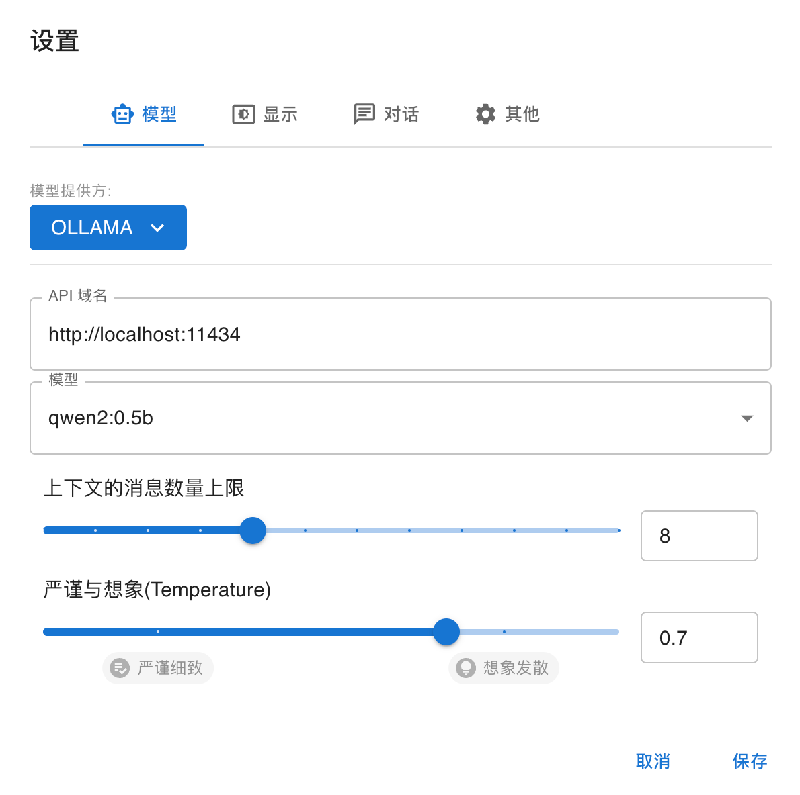

# Chatbox

[ChatBox](https://github.com/Bin-Huang/chatbox/releases) 一款支持多种大语言模型应用的跨平台桌面端软件。

## 1. 下载

访问 ChatBox 的 Github 仓库，在 Releases 中下载软件包并安装。

## 2. 功能

目前 ChatBox 支持 OpenAI、Azure、Clude、Gemini、Groq、ChatGLM、Ollama 等大语言模型的服务，其中 Ollama、ChatGLM 也支持本地化的服务。

## 3. 启动 Ollama 服务

使用 `ollama serve` 启动模型服务后，在 ChatBox 中选择 Ollama，并在 **API域名** 中填写 http://localhost:11434 ，模型列表下拉框会自动加载 Ollama 所下载的模型（我这里只下载了 Qwen2 的 0.5B 和 1.5B 的模型）。

